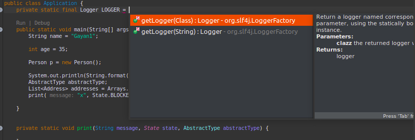
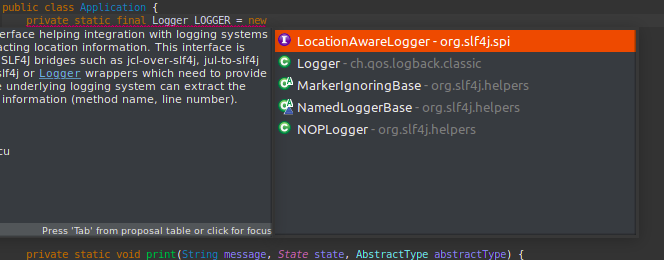
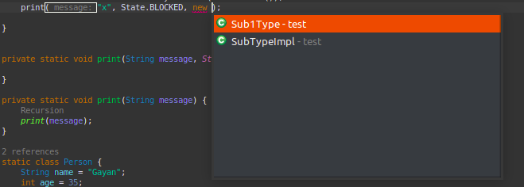
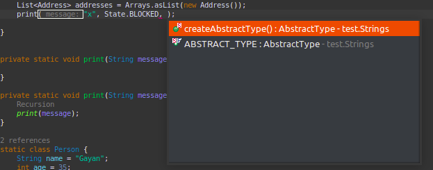
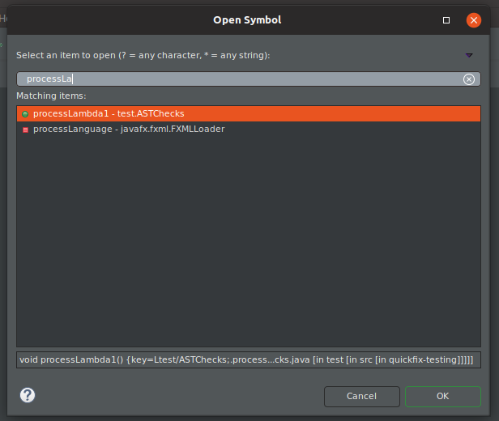

# GAP Eclipse JDT
This plugin enhances the existing JDT experience by adding more feature into it. Some of the features are 
inspired from other IDEs such as vscode and IntelliJ.

## Features
- Smart SubType Provider

    You can invoke this completions by pressing **SHIFT+CTRL+ALT+SPACE**

    This is a JDT completion contributor which provide suggestions like
    - Subtypes for variable assignments for both fields and method parameters.
    - Search for static factory methods and constants for both fields and method parameters.
    - Suggest enum literals for method parameters (field doesn't work out of the box in JDT)

    Following are screenshots in action
    

    

    

    

    **Note :** This contributor is bit slow.

  
- Symbol Search (Open Symbol Dialog)
This feature will enable you to search for methods and fields in the workspace and to navigate into them.

  
  
## Update site
[https://dl.bintray.com/gayanper/p2/gap-eclipse-jdt/](https://dl.bintray.com/gayanper/p2/gap-eclipse-jdt/)